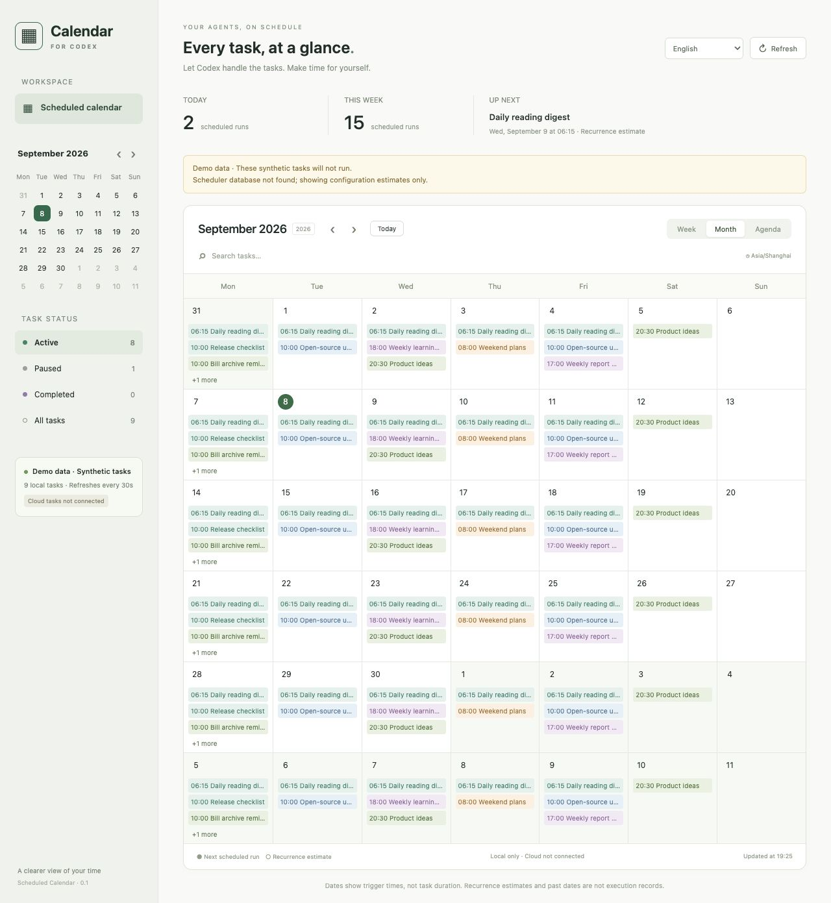

# Scheduled Calendar

**English** | [简体中文](README.zh-CN.md)

**A calendar for your existing local Codex automations. No task migration needed.**

[Download beta.3](https://github.com/qmkCamel/scheduled-calendar/releases/tag/v0.1.0-beta.3) · [Usage guide (Chinese)](plugins/scheduled-calendar/README.md) · [Privacy](plugins/scheduled-calendar/PRIVACY.md) · [Report an issue](https://github.com/qmkCamel/scheduled-calendar/issues)



## Features

- Browse scheduled automations in week, month, and agenda views.
- Search tasks, filter active/paused/completed states, and read task details.
- Distinguish the scheduler's next run from estimated recurrence dates.
- See continuous monitors, overdue tasks, and tasks that need review separately.
- Refresh automatically every 30 seconds, with read-only access to local data.

## Installation

**Preview requirements: macOS, Python 3.11+, and a plugin-capable Codex CLI/desktop app.** The beta.3 release supports English and Simplified Chinese. It follows your browser’s primary language (other languages fall back to English); use the language menu to override it. The preference is saved for the current browser origin. Task names and instructions stay in their original language.

```sh
codex plugin marketplace add qmkCamel/scheduled-calendar --ref v0.1.0-beta.3
codex plugin add scheduled-calendar@scheduled-calendar-community
```

Then start a new Codex task and ask: **“Open the scheduled calendar.”**

Alternatively, download `scheduled-calendar-0.1.0-beta.3.zip` and `SHA256SUMS` from the release page. Run `shasum -a 256 -c SHA256SUMS` in the download directory, extract the ZIP to a permanent directory, and enter `scheduled-calendar-0.1.0-beta.3/`. Run `codex plugin marketplace add .` there, followed by the same plugin installation command above. Recurrence dependencies are bundled; no `pip install` is needed.

You can also launch the calendar directly from the extracted root without installing the Codex plugin:

```sh
python3 plugins/scheduled-calendar/scripts/launch.py
```

Open the local URL printed by the launcher. To stop the service, run `python3 plugins/scheduled-calendar/scripts/launch.py --stop` from the same extracted root; use `--status` to check its status. Closing the page does not stop the service. See the [usage guide (Chinese)](plugins/scheduled-calendar/README.md) for updates, uninstalling, and handling duplicate installations.

## Preview limitations

- Supports tasks on this machine only. **Cloud tasks are not connected yet.**
- Opens a standalone browser panel. **It does not replace the native Scheduled page.**
- Reads internal TOML/SQLite storage without modifying or executing tasks. Codex updates may require adapter changes.
- Missing time zones or recurrence start dates are shown as assumptions. Projected and historical dates are not proof of successful execution.
- Verified on one physical Mac using Python 3.11/3.14, different installation paths, and isolated data directories. A second physical machine, Windows, and Linux have not been validated.
- No developer backend, telemetry, or ads. When a browser or AI host reads the page, that host's own permissions and privacy settings apply.

This is an independent community project, unaffiliated with OpenAI. It has not been submitted for review in the official plugin directory.

## TODO

- [ ] Cloud task calendar support: investigate available, authorized task-query interfaces; retrieve task names, status, time zones, recurrence rules, and next run times; display cloud and local tasks together with clear source labels. Validate cloud-only and mixed local/cloud scenarios, prevent duplicate entries, and clearly report insufficient permissions or incomplete data. Not implemented yet; no delivery date is committed.

## Development and releases

```sh
python3 -m unittest discover -s plugins/scheduled-calendar/tests -v
node --test plugins/scheduled-calendar/tests/test_i18n.cjs
python3 plugins/scheduled-calendar/scripts/build_release.py --output dist
```

The generated ZIP includes the complete plugin directory and a local marketplace entry. Use `SHA256SUMS` to verify the download. Tests use isolated temporary data; HTTP and lifecycle tests require permission to listen on local ports. The build script uses an explicit public-file allowlist and excludes real tasks, databases, logs, and Python caches.

[Verification record](plugins/scheduled-calendar/VERIFICATION.md) · [Changelog](plugins/scheduled-calendar/CHANGELOG.md) · [Third-party licenses](plugins/scheduled-calendar/THIRD_PARTY_NOTICES.md)

## License

[MIT](LICENSE). Bundled dependencies retain their original licenses. Please use synthetic examples when reporting issues; never upload credentials, private task prompts, or local databases.
