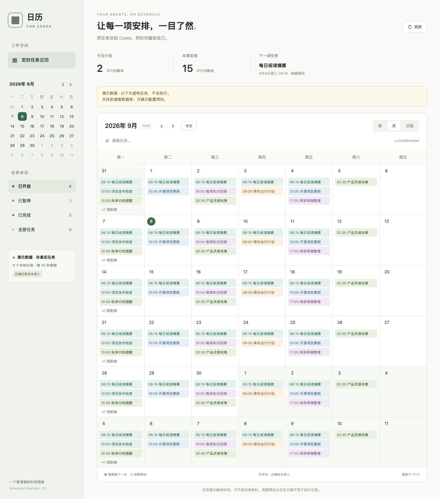

# Scheduled Calendar · 定时任务日历

**给已有 Codex 本地定时任务补一个日历，无需迁移任务。**

[下载预览版](https://github.com/qmkCamel/scheduled-calendar/releases) · [使用说明](plugins/scheduled-calendar/README.md) · [隐私说明](plugins/scheduled-calendar/PRIVACY.md) · [反馈问题](https://github.com/qmkCamel/scheduled-calendar/issues)



## 能做什么

- 周、月和日程视图，按日期查看自动化安排。
- 搜索任务、筛选开启/暂停/完成状态、查看任务说明。
- 区分调度器的下一次运行和周期规则预估。
- 单独展示持续监控、过期及需要核对的任务。
- 每 30 秒自动刷新，数据只读留在本机。

## 安装

**预览版要求：macOS、Python 3.11+、支持插件的 Codex CLI/桌面应用。** 界面目前为简体中文。

```sh
codex plugin marketplace add qmkCamel/scheduled-calendar --ref v0.1.0-beta.1
codex plugin add scheduled-calendar@scheduled-calendar-community
```

然后新建一个 Codex 任务，说：**“打开定时任务日历”**。

也可以下载发行版 ZIP，解压到固定目录，在该目录执行 `codex plugin marketplace add .`，再运行相同的插件安装命令。ZIP 内已包含周期解析依赖，无需 `pip install`。

如果尚未安装 Codex 插件，也可在解压根目录直接运行：

```sh
python3 plugins/scheduled-calendar/scripts/launch.py
```

打开输出的本地 URL。停止服务请在相同插件目录运行 `scripts/launch.py --stop`；查询状态使用 `--status`。关闭页面本身不会停止服务。完整更新、卸载与重复安装处理见[使用说明](plugins/scheduled-calendar/README.md)。

## 预览版边界

- 仅支持本机任务，**云端任务未接入**。
- 在独立浏览器面板打开，**不替换原生 Scheduled 页面**。
- 只读内部 TOML/SQLite 存储，不修改或执行任务；Codex 更新可能需要适配。
- 缺少时区/周期起点时明确显示假设；预估日期和历史日期不等于成功执行记录。
- 已在同一台 macOS 机器的 Python 3.11/3.14、不同安装目录和隔离数据目录验证；第二台机器、Windows、Linux 尚未验收。
- 没有开发者后端、遥测或广告。浏览器/AI 宿主读取页面时适用宿主自己的权限和隐私设置。

这是独立社区项目，与 OpenAI 无关联，也未提交官方插件目录审核。

## 开发与发行

```sh
python3 -m unittest discover -s plugins/scheduled-calendar/tests -v
python3 plugins/scheduled-calendar/scripts/build_release.py --output dist
```

生成的 ZIP 带完整插件目录及本地市场入口，`SHA256SUMS` 用于核对下载包。测试使用隔离的临时数据；HTTP/启停测试需要允许本机端口监听。构建脚本使用公开文件白名单，不打包真实任务、数据库、日志或 Python 缓存。

[验证记录](plugins/scheduled-calendar/VERIFICATION.md) · [更新记录](plugins/scheduled-calendar/CHANGELOG.md) · [第三方许可证](plugins/scheduled-calendar/THIRD_PARTY_NOTICES.md)

## English

A small, read-only calendar for **existing local Codex automations**. See scheduled work in week, month, or agenda views without moving your tasks to another scheduler. It includes search, status filters, task details, and automatic refresh.

This experimental preview targets **macOS + Python 3.11+**. The UI is Simplified Chinese. It opens a standalone loopback browser panel, does not replace Codex's native Scheduled page, and does not support cloud tasks. Internal Codex storage formats may change. Recurrence projections are estimates, not execution records.

Install using the two commands above, then ask Codex to “open the scheduled calendar” in a new task. Dependencies are bundled. No model API key, analytics, or developer backend is required. Read the [privacy policy](plugins/scheduled-calendar/PRIVACY.md) and [verification boundaries](plugins/scheduled-calendar/VERIFICATION.md).

## License

[MIT](LICENSE). Bundled dependencies retain their original licenses. Please use synthetic examples when reporting issues; never upload credentials, private task prompts, or local databases.
