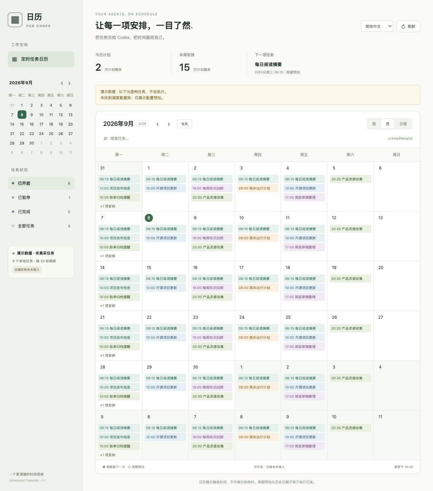

# Scheduled Calendar · 定时任务日历

[English](README.md) | **简体中文**

**给已有 Codex 本地定时任务补一个日历，无需迁移任务。**

[下载 beta.3](https://github.com/qmkCamel/scheduled-calendar/releases/tag/v0.1.0-beta.3) · [使用说明](plugins/scheduled-calendar/README.md) · [隐私说明](plugins/scheduled-calendar/PRIVACY.md) · [反馈问题](https://github.com/qmkCamel/scheduled-calendar/issues)



## 能做什么

- 周、月和日程视图，按日期查看自动化安排。
- 搜索任务、筛选开启/暂停/完成状态、查看任务说明。
- 区分调度器的下一次运行和周期规则预估。
- 单独展示持续监控、过期及需要核对的任务。
- 每 30 秒自动刷新，数据只读留在本机。

## 安装

**预览版要求：macOS、Python 3.11+、支持插件的 Codex CLI/桌面应用。** beta.3 发行版支持英文和简体中文，默认跟随浏览器首选语言（其他语言回退英文），可从顶部语言菜单手动切换；偏好保存在当前浏览器来源中。任务名称与正文保留原文。

```sh
codex plugin marketplace add qmkCamel/scheduled-calendar --ref v0.1.0-beta.3
codex plugin add scheduled-calendar@scheduled-calendar-community
```

然后新建一个 Codex 任务，说：**“打开定时任务日历”**。

也可以从发行页下载 `scheduled-calendar-0.1.0-beta.3.zip` 和 `SHA256SUMS`，在下载目录运行 `shasum -a 256 -c SHA256SUMS` 校验。将 ZIP 解压到固定位置，进入 `scheduled-calendar-0.1.0-beta.3/`，执行 `codex plugin marketplace add .`，再运行相同的插件安装命令。ZIP 内已包含周期解析依赖，无需 `pip install`。

如果尚未安装 Codex 插件，也可在解压根目录直接运行：

```sh
python3 plugins/scheduled-calendar/scripts/launch.py
```

打开输出的本地 URL。停止服务请在解压根目录运行 `python3 plugins/scheduled-calendar/scripts/launch.py --stop`；查询状态使用 `--status`。关闭页面本身不会停止服务。完整更新、卸载与重复安装处理见[使用说明](plugins/scheduled-calendar/README.md)。

## 预览版边界

- 仅支持本机任务，**云端任务未接入**。
- 在独立浏览器面板打开，**不替换原生 Scheduled 页面**。
- 只读内部 TOML/SQLite 存储，不修改或执行任务；Codex 更新可能需要适配。
- 缺少时区/周期起点时明确显示假设；预估日期和历史日期不等于成功执行记录。
- 已在同一台 macOS 机器的 Python 3.11/3.14、不同安装目录和隔离数据目录验证；第二台机器、Windows、Linux 尚未验收。
- 没有开发者后端、遥测或广告。浏览器/AI 宿主读取页面时适用宿主自己的权限和隐私设置。

这是独立社区项目，与 OpenAI 无关联，也未提交官方插件目录审核。

## TODO

- [ ] 云端任务日历支持：调研可用且获授权的任务查询接口，接入任务名称、状态、时区、周期规则和下一次运行时间；与本地任务统一展示并标明来源。验收需覆盖仅云端及本地/云端混合场景，避免重复展示，并明确提示权限不足或数据不完整。当前仍未接入，暂不承诺完成时间。

## 开发与发行

```sh
python3 -m unittest discover -s plugins/scheduled-calendar/tests -v
node --test plugins/scheduled-calendar/tests/test_i18n.cjs
python3 plugins/scheduled-calendar/scripts/build_release.py --output dist
```

生成的 ZIP 带完整插件目录及本地市场入口，`SHA256SUMS` 用于核对下载包。测试使用隔离的临时数据；HTTP/启停测试需要允许本机端口监听。构建脚本使用公开文件白名单，不打包真实任务、数据库、日志或 Python 缓存。

[验证记录](plugins/scheduled-calendar/VERIFICATION.md) · [更新记录](plugins/scheduled-calendar/CHANGELOG.md) · [第三方许可证](plugins/scheduled-calendar/THIRD_PARTY_NOTICES.md)

## 许可证

[MIT](LICENSE)。内置依赖保留其原始许可证。反馈问题时请使用虚构示例，不要上传凭据、私密任务正文或本地数据库。
